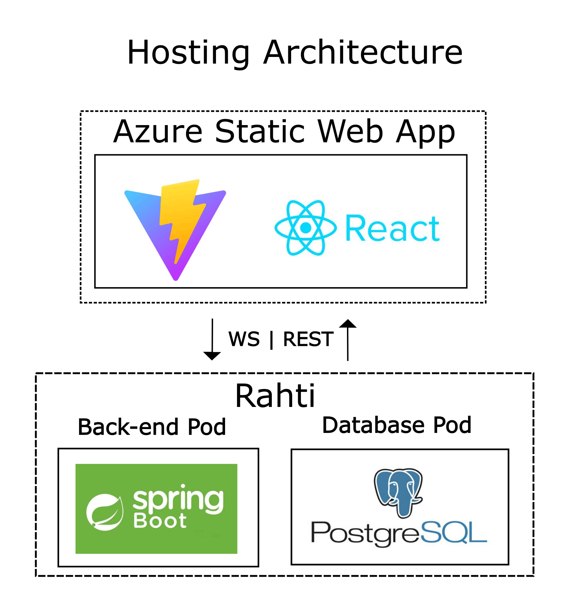

# Prokress

## Project Name and Description

Prokress is a project management application designed to help teams manage projects, tasks, user roles, and work progress in one place.

## Demo

<video src="prokress/public/Prokress Demo.mp4" controls width="640">
  Your browser does not support the video tag. <a href="prokress/public/Prokress Demo.mp4">Download video</a>.
</video>

### Current Features

- User registration and authentication with JWT-based login
- Create personal and shared projects
- Organize tasks with task lists within projects
- Real-time task management - add, edit and remove tasks instantly
- Drag and drop functionality for task management
- Real-time task tracking with WebSocket support
- User-friendly interface with responsive design

### Upcoming Features

- Task assignment to specific team members
- User role management and permissions
- Task commenting
- Custom background image selection
- Advanced search functionality for tasks
- Calendar and backlog view navigation
- Team member management for project managers

## Backlog

- GitHub Projects backlog: [Git-Happens-HH project 1](https://github.com/orgs/Git-Happens-HH/projects/1)

## Production Deployments

- Backend: [https://project-management-app-prokress-backend.2.rahtiapp.fi/](https://project-management-app-prokress-backend.2.rahtiapp.fi/)
- Frontend: [https://yellow-mud-05a9abf03.1.azurestaticapps.net](https://yellow-mud-05a9abf03.1.azurestaticapps.net)

## License

This project is licensed under the MIT License - see the [LICENSE](https://github.com/Git-Happens-HH/Project-management-backend/blob/main/LICENSE) file for details.

## Application Architecture

## Technologies

- Node 22.18.0
- Vite 7.2.4
- React 19.2.0
- Tailwind CSS 4.1.18
- stompjs 2.3.3
- dndkit 6.3.1
- typescript 5.9.3

## Deployment & CI/CD

The application uses GitHub Actions for continuous integration and deployment.

### GitHub Actions Workflows

- Automatic deployment from main

### Deployment Infrastructure

- Backend deployed on Rahti (OpenShift) with PostgreSQL database
- Frontend deployed on Azure Static Web Apps
- OpenShift manifests in [ops/openshift/](ops/openshift/) - Kubernetes deployment configurations, services, and routes
